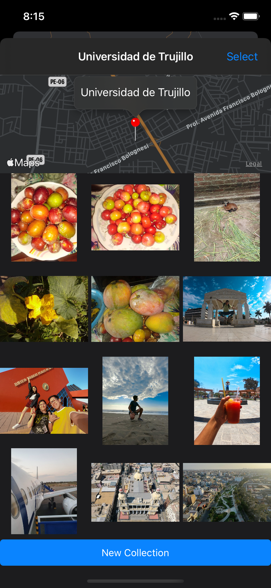

# VirtualTourist App

Project of the [iOS Developer Nanodegree course](https://www.udacity.com/course/ios-developer-nanodegree--nd003).

## Getting Started

Download the project from [Github](https://github.com/RicardoBravoA/VirtualTourist), the updated branch is **main**

## Project Instructions

The project has this features.

    
    
    
    
    

- Main
    - Map View.
    - Long press for add an item.
    - Press the Pin and show tooltip.
    - Press tooltip and show photos.
    - Save locations with Core Data.
- Photos View
    - Download photos from Flicker Api.
    - Save photos with Core Data.
    - Delete photos

## License

    Copyright 2021 Ricardo Bravo (Woz).

    Licensed under the Apache License, Version 2.0 (the "License");
    you may not use this file except in compliance with the License.
    You may obtain a copy of the License at

       http://www.apache.org/licenses/LICENSE-2.0

    Unless required by applicable law or agreed to in writing, software
    distributed under the License is distributed on an "AS IS" BASIS,
    WITHOUT WARRANTIES OR CONDITIONS OF ANY KIND, either express or implied.
    See the License for the specific language governing permissions and
    limitations under the License.